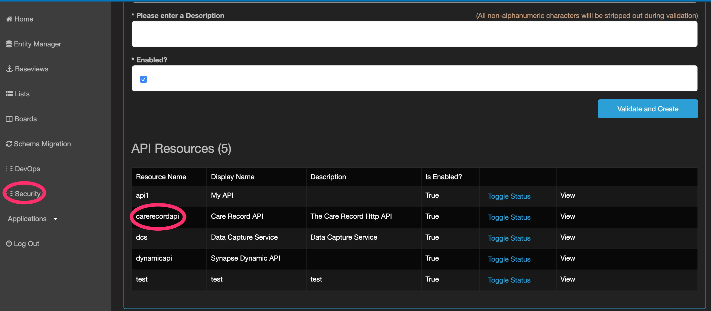
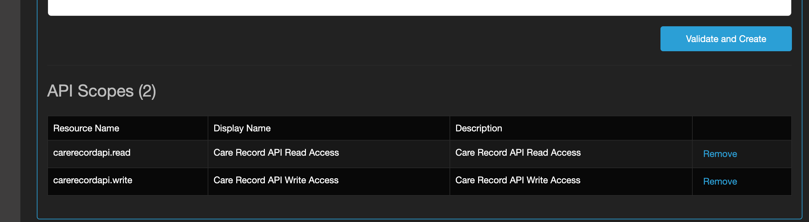
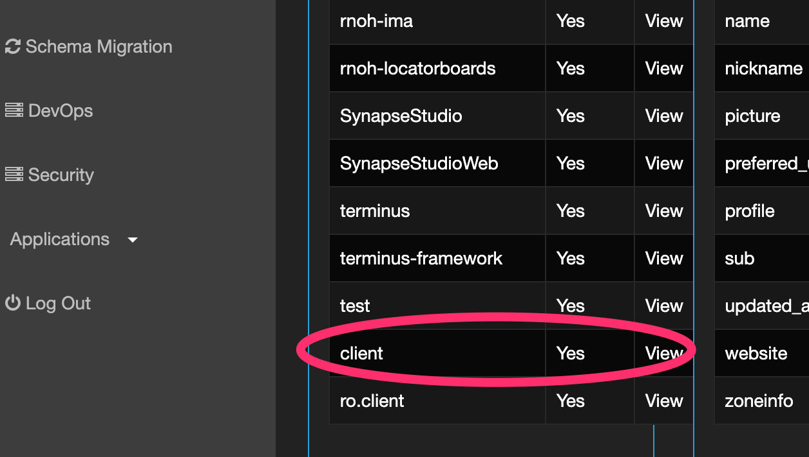
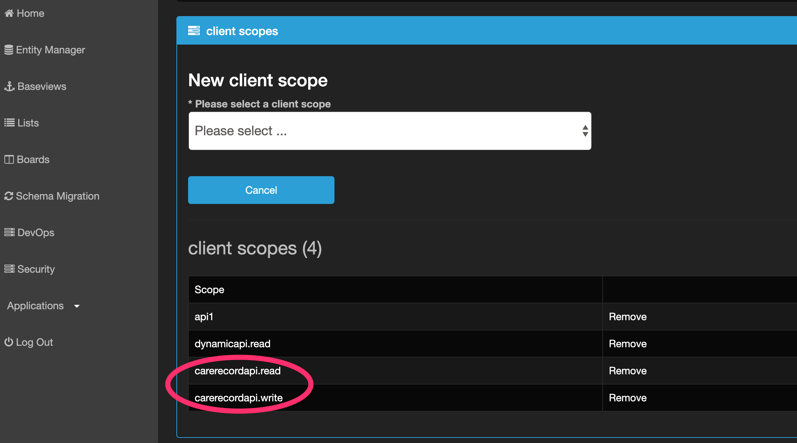
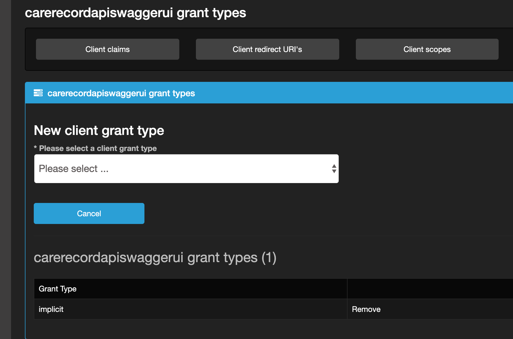
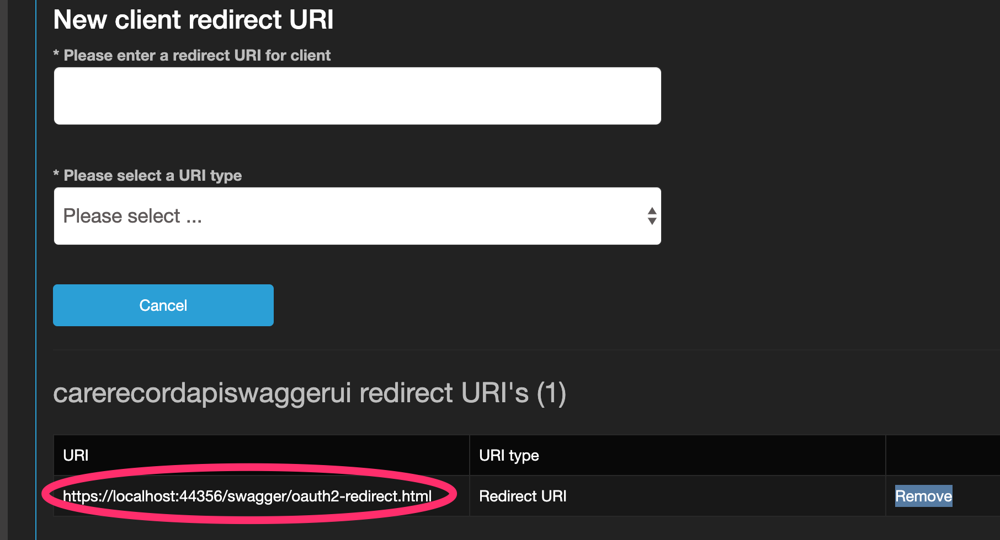

### 										**Configuration**

###### Security Configuration

1. API Resource Configuration

   Add Resource: "carerecordapi"

   

   

   Add new Scopes: "carerecordapi.read" and "carerecordapi.write"

   

​		Add newly created Scopes to 'client':

Swagger Authorization Configuration:

1. Create Client APP: "carerecordapiswaggerui"

   

2. Create Flow : "Implicit"

   

3. Configure Redirect Uri's: "<Base URL of Care Record API>/swagger/oauth2-redirect.html"

   

###### Project: Interneuron.CareRecord.API.Gateway

- File: Ocelot.json

1. "GlobalConfiguration": 

  		"BaseUrl": **"<Base URL of the Gateway application>"**

2. "ReRoutes":

​	"DownstreamHostAndPorts": 

​     	"Host": "<Base Url of the service application e.g. CareRecord.API>",

​     	"Port": <Port number of the service application e.g. CareRecord.API>"

- File: appsettings.json

  1. "Logs": 

       ​	"PostgresLogging": {

       ​	 	"Connectionstring": "<Database Connection string>"

  2. "ServicesSwagger": 

       "Urls": [ "<Base Url of Service API e.g. Care Record API>/swagger" ]

  3. "HC": 

       "CareRecordAPIURL": "<Base Url of Service API e.g. Care Record API>/hc"

 		4. "CareRecordConfig": 

  				"AuthorizationAuthority": "<Identity Server URL>",

  				"AuthorizationAudience": "carerecordapi",

  				"WriteAccessAPIScope": "carerecordapi.write",

  				"ReadAccessAPIScope": "carerecordapi.read"

###### Project: Interneuron.CareRecord.API

- File: appsettings.json

1. "Logs": 

   ​	"PostgresLogging": 

   ​	 	"Connectionstring": "<Database Connection string>"

2.  "ConnectionStrings": 

     	"SynapseDBConnection": "<Database Connection string>"

3. "CareRecordSettings": 

     	"Endpoint": "<Base url of Care Record API>/fhir"

4.  "CareRecordConfig": 

     	"HospitalNumberReference": "<Reference Hospital ID Type Code>",

    	 "AuthorizationAuthority": "<Identity Server URL>",

     	"AuthorizationAudience": "carerecordapi",

     	"WriteAccessAPIScope": "carerecordapi.write",

     	"ReadAccessAPIScope": "carerecordapi.read"

    

5. "Swagger": 

     	"AuthorizationAuthority": "<Identity Server URL>",

     	"OAuthClientId": "carerecordapiswaggerui",

     	"OAuthClientName": "Care Record API Swagger UI",

    	 "AccessScopes": "carerecordapi.read:Care Record API Read Profile;carerecordapi.write:Care Record 		API Write Profile;"

   

   

    